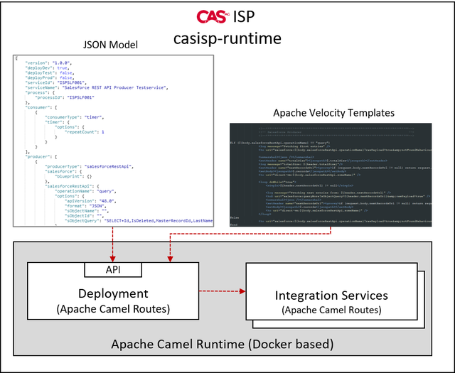

# casisp-runtime

The purpose of the casisp-runtime is to setup, configure and run Apache Camel based integration services in a small amount of time and with no or less knowledge of the Apache Camel components.



It comes first with a set of Apache Velocity Templates that contain a ready to run DSL snippets for the mostly used Apache Camel components. Two frame Apache Velocity Templates contain further the skeleton for an Integration Service and an Integration API.
Finally an Integration Service and an Integration API will be running as an Apache Camel Route on the Docker based Runtime.

The second important parts are the JSON Schemas [integrationservice.schema.json](var/casisp/templates/integrationservice.schema.json) and [integrationapi.schema.json](var/casisp/templates/integrationapi.schema.json). These JSON Schemas define the JSON model for the Apache Camel Components configuration.

## Pre-requisites

Following pre-requisites are required to run the casisp-runtime

### Windows

- [Docker Desktop for Windows](https://hub.docker.com/editions/community/docker-ce-desktop-windows)
- Drive E: (can be changed within the file [docker-compose_Windows.yml](bin/docker/docker-compose_Windows.yml))
- Base directory `E:\var\casisp` with the copy of [var/casisp](var/casisp)

### Linux

- [Docker Engine for Linux](https://docs.docker.com/engine/install/)
- User account casisp:casisp with the uid:gid 2000
- `create-casisp.sh`, `start-casisp.sh`, `stop-casisp.sh` and `deploy-service.sh` must be executable
- Base directory `/var/casisp` with the copy of [var/casisp](var/casisp)

## Setup the Apache Camel runtime

The foundation is a ready-to-run docker container based on [Apache Karaf 4.2.9](https://karaf.apache.org/) and [Apache Camel 3.4.4](https://camel.apache.org/). Once the pre-requisites are given you can move into the folder `docker` and start the container with (Windows):

````
create-casisp.bat
````
or (Linux):
````
./create-casisp.sh
````
The Docker container contains the following artefacts:

````
feature:repo-add hawtio 2.10.1
feature:repo-add activemq 5.16.0
feature:repo-add camel 3.4.4
feature:install pax-http-undertow
feature:install hawtio activemq-broker-noweb camel camel-jms jms camel-http camel-servlet camel-swagger-java camel-ftp camel-jackson camel-jsonpath camel-validate-json camel-zipfile camel-velocity camel-groovy camel-salesforce camel-kafka
````
## Creating the first Integration Service

The first service is a HTTP based "Hello World!" Integration Service. The JSON Model looks like following:
````json
{
    "version": "1.0.0",
    "deployDev": true,
    "deployTest": false,
    "deployProd": false,
    "serviceId": "hello",
    "serviceName": "Hello World",
    "process": {
        "processId": "hello"
    },
    "consumer": [
        {
            "consumerType": "http",
            "http": {
                "etc": {
                    "fileCreateFlag": true,
                    "filePrefix": "org.ops4j.pax.web.context-admin",
                    "basicAuthentication": {
                        "credentials": [
                            {
                                "rolename": "admin"
                            }
                        ]
                    }
                },
                "blueprint": {},
                "contextPath": "hello",
                "relativePath": "get"
            }
        }
    ],
    "processor": [
        {
            "processorType": "setBody",
            "setBody": {
                "language": "constant",
                "expression": "Hello World!"
            }
        }
    ],
    "producer": []
}

````
The casisp does have a deployment API that expects the JSON Model within a POST request. For the first start the casisp-runtime is being delivered with deployment scripts for Windows and Linux. These expect a parameter for a file containing the JSON model for an Integration Service or Integration API.

The "Hello World!" Integration Service can be deployed as following (Windows):
````
deploy-service.bat samples/hello.json
````
or (Linux):
````
./deploy-service.sh samples/hello.json
````
If the request has been successfully the response looks like:
````json
{
    "responseCode": 200,
    "responseMessage": "Service model 'TSTISP001' succesfully parsed and deployment initiated."
}
````
The Integration Service can be called with (Windows):
````
curl --insecure --request GET "https://localhost:8443/hello/get" -u admin:passw0rd
````
or (Linux):
````
curl --insecure --request GET 'https://localhost:8443/hello/get' -u admin:passw0rd
````
The response of the "Hello World!" Integration Service looks like:
````
Hello World!
````
## Standard user
The Apache Karaf standard user is
````
admin
passw0rd
````
To modify this user you must edit the etc/users.properties file. The admin user is also securing the deployment API.
## Component configuration
For the component references please check the following pages:
### Consumer

- [File](doc/consumer.file.md)
- [SFTP](doc/consumer.sftp.md)
- [JMS](doc/consumer.jms.md)
- [Timer](doc/consumer.timer.md)
- [HTTP](doc/consumer.http.md)
- [Directvm](doc/consumer.directvm.md)
- [SalesforceCdc](doc/consumer.salesforceCdc.md)

### Processors


### Producers

